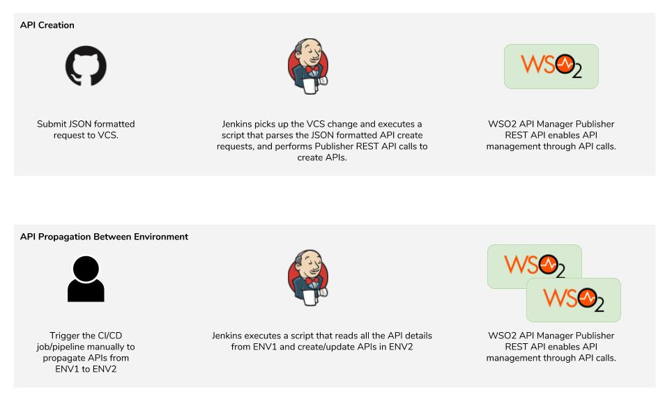
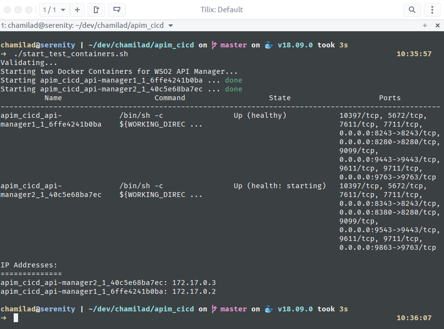
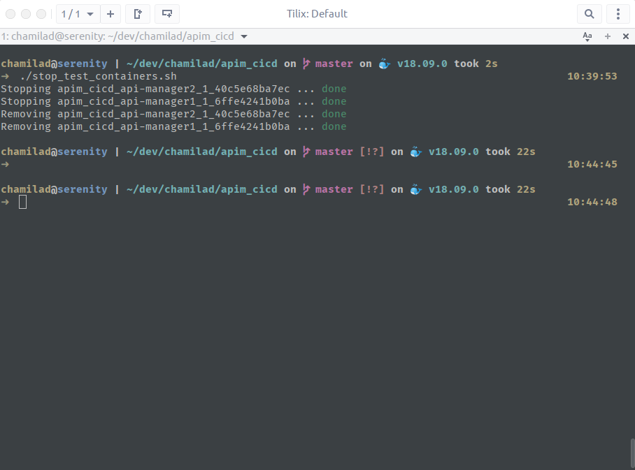
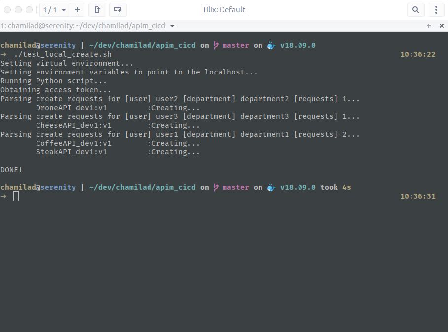
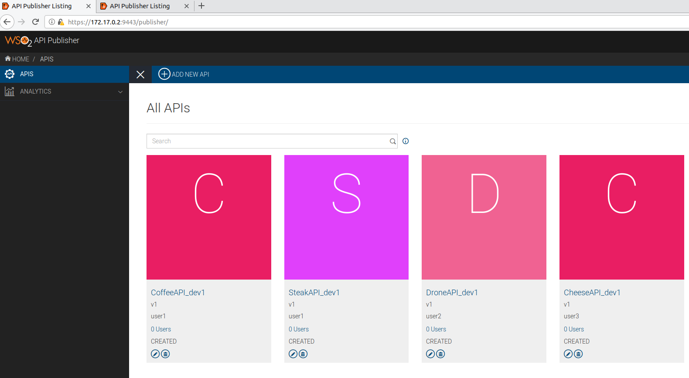
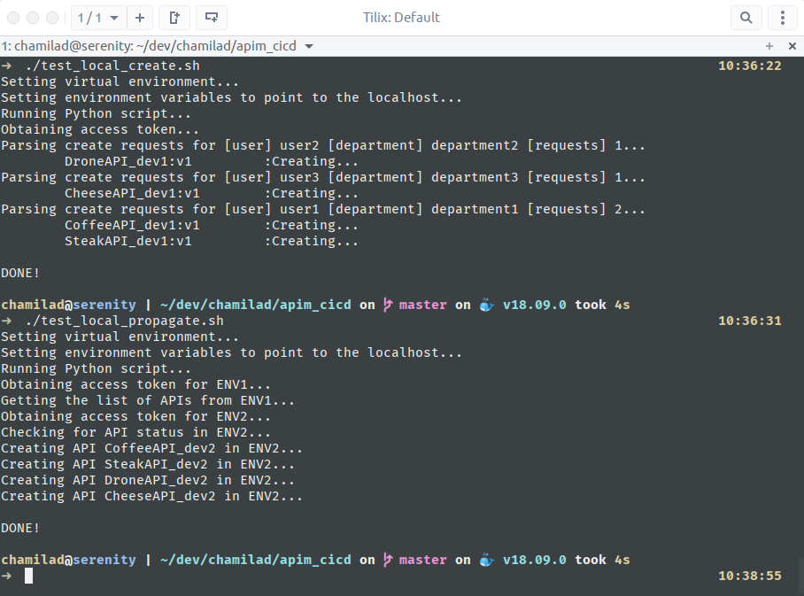
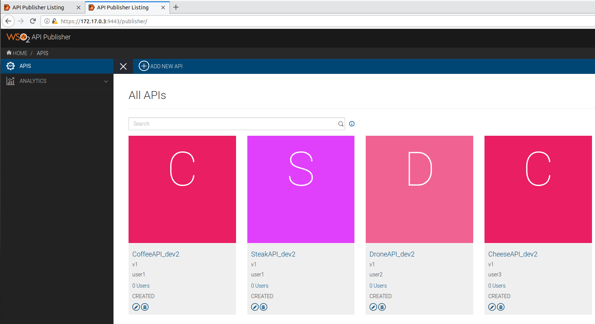
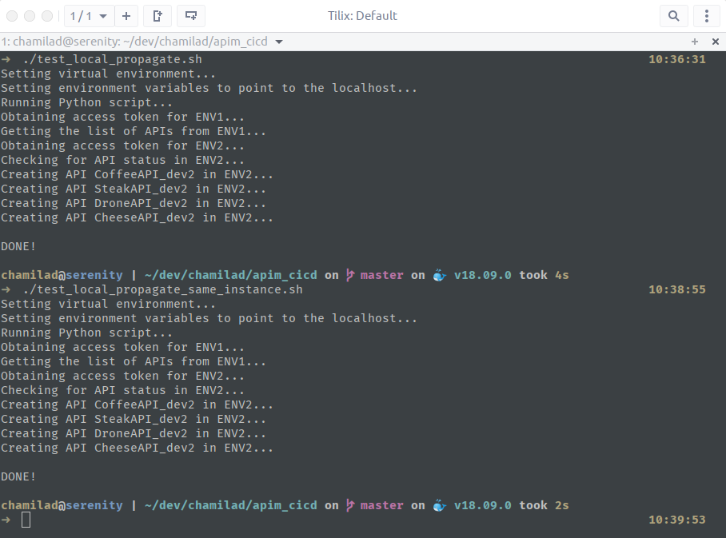
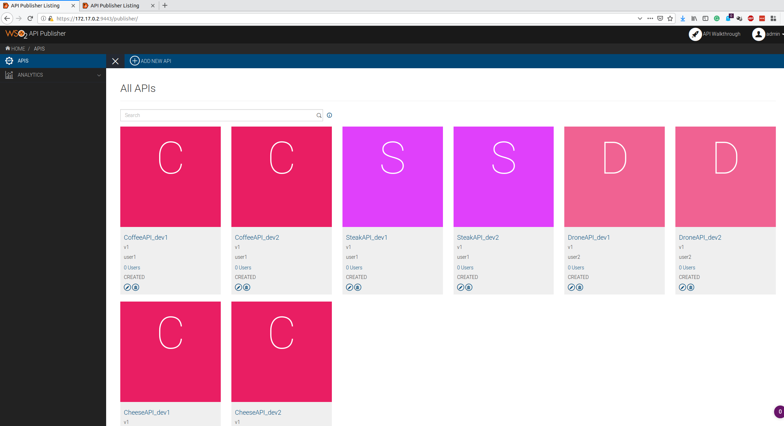

# API CI/CD with WSO2 API Manager

This set of scripts is a proof of concept on [how to do API CI/CD with WSO2 API Manager using the WSO2 API Manager Publisher REST API](https://medium.com/@chamilad/ci-cd-apis-with-wso2-api-manager-93d0f7688078). 

1. [User Stories](#user-stories)
    1. [Context](#context)
    2. [API Creation](#api-creation)
    3. [API Propagation](#api-propagation-between-environments)
    4. [Assumptions](#assumptions)
2. [Implementation](#implementation)
    1. [Prerequisites](#prerequisites)
    2. [Configuration](#configuration)
    3. [API Create Request Definition](#api-create-request-definitions)
    4. [API Create vs Update](#api-creation-vs-update)
    5. [Import/Export vs Publisher APIs](#importexport-vs-publisher-apis)
3. [Testing](#testing)
    1. [Setup](#setup)
    2. [Running the tests](#running-the-tests)
        1. [Creating the APIs](#creating-the-apis)
        2. [Propagating APIs between different environments](#propagating-apis-between-different-environments)
        3. [Propagating APIs in the same environment](#propagating-apis-in-the-same-environment)


## User Stories

### Context
This PoC assumes a deployment with the following criteria.
1. There are one or more API Manager deployments that manage APIs belonging to different departments.
2. Environments are either separated as different deployments or differently named (and contexted) APIs in the same environment (e.g.: lower level dev* environments could be in the same API Manager deployment)
3. API Management is done by a different team from the teams that actually implement and consume APIs

These scripts have taken the following user stories into consideration. 
### API Creation
When there is a need to create a new API, the implementation party will put a request (e.g. in writing as an email or an entry in the ticketing system). This request will ultimately be converted to a standard JSON format that is machine readable.

For an example, the JSON format the script recognizes is as follows. It contains only the basic information needed to create an API. 

```json
{
  "username": "Username of the user",
  "department": "Department of the user",
  "apis": [
    {
      "name": "SampleAPI_dev1",
      "description": "Sample API description",
      "context": "/api/dev1/sample",
      "version": "v1"
    }
  ]
}
```

The JSON-Schema for this is as follows.

```json
{
  "$schema": "http://json-schema.org/draft-04/schema#",
  "type": "object",
  "properties": {
    "username": {
      "type": "string"
    },
    "department": {
      "type": "string"
    },
    "apis": {
      "type": "array",
      "items": [
        {
          "type": "object",
          "properties": {
            "name": {
              "type": "string"
            },
            "description": {
              "type": "string"
            },
            "context": {
              "type": "string"
            },
            "version": {
              "type": "string"
            }
          },
          "required": [
            "name",
            "description",
            "context",
            "version"
          ]
        }
      ]
    }
  },
  "required": [
    "username",
    "department",
    "apis"
  ]
}
```

This JSON content will be submitted to a VCS (e.g. Git) that will trigger an Automation Tool job (e.g. Jenkins). The automation tool job can execute the Python script [`api_create.py`](api_create.py) which does the following.
1. Read and parse the JSON based API create requests
2. Submit API create REST calls to the provided API Manager Publisher REST API

This way, the API create requests can be used as the trigger point to automate the API creation flow.

When the APIs are created, the implementation party can login to the Publisher UI and implement the API and publish it. 

### API Propagation Between Environments
After the APIs are published and tested in a particular environment, they have to be promoted to the next environment. This process can be triggered manually as an automation tool job (e.g. Jenkins job or pipeline). 

The script executed in this step, [`api_propagate.py`](api_propagate.py), will pull all API details from one environment and create/update APIs based on those details in the next environment. During this process, additional steps like API renaming, context renaming, and backend switching can also be done if they conform to a pattern. 

### Assumptions
In codifying the stories, the scripts have made the following assumptions for the ease of implementation. Scenarios that fall out of the following criteria can also use these scripts, provided certain changes are introduced. 
1. Backend URLs - The backend URLs of the APIs are basically uniform and fall within a pattern that makes it easy to change backend URLs when APIs are promoted between environments. 
2. Emails are not used as usernames for WSO2 API Manager. If this is used, configuration changes in the WSO2 API Manager should be done in order to allow proper use of the feature.
3. APIs versioning feature is not used. [`api_propagate.py`](api_propagate.py) script does not take into account the existence of different versions of the same API. Therefore, no API Version Creation requests are made. If this feature is used, the script has to modified so that it takes into account this possibility.

## Implementation
### Prerequisites
These scripts require Python 2.7. Furthermore, `requests` Python library is used to make REST API calls. 

To setup the environment with the dependencies, use [`setup.sh`](setup.sh) script. This will create a Python2.7 [Virtual Environment](https://virtualenv.pypa.io/en/latest/), and install the dependencies mentioned in the [`requirements.txt`](requirements.txt) file. 

If you already have setup an environment (e.g. an existing virtual environment), load the environment and check if the dependencies are met with the script [`check_requirements.sh`](check_requirements.sh).

> If you are setting up a virtual environment manually, better name it `venv` as the helper scripts for testing work with that name.

### Configuration
The Python scripts take the required parameters as environment variables. Therefore, any automation tool that executes these scripts should inject the environment variables with the proper values during execution. For an example, Jenkins can make use of [EnvInject](https://plugins.jenkins.io/envinject) plugin to load environment variabels from a pre-populated properties file for a build job.

The environment variables required for each script are as follows.
##### [`api_create.py`](api_create.py)
* API Manager URL - `WSO2_APIM_APIMGT_URL`
* Gateway URL - `WSO2_APIM_GW_URL`
* API Manager Username - `WSO2_APIM_APIMGT_USERNAME`
* API Manager Password - `WSO2_APIM_APIMGT_PASSWD`
* Verify SSL flag - `WSO2_APIM_VERIFY_SSL`
* Production Backend URL - `WSO2_APIM_BE_PROD`
* Sandbox Backend URL - `WSO2_APIM_BE_SNDBX`
* API Status - `WSO2_APIM_API_STATUS`

##### [`api_propagate.py`](api_propagate.py)
* ENV1 API Manager URL - `WSO2_APIM_ENV1_APIMGT_URL`
* ENV1 Gateway URL - `WSO2_APIM_ENV1_GW_URL`
* ENV1 API Manager Username - `WSO2_APIM_ENV1_APIMGT_USERNAME`
* ENV1 API Manager Password - `WSO2_APIM_ENV1_APIMGT_PASSWD`
* ENV1 Identifier - `WSO2_APIM_ENV1_ID`
* ENV2 API Manager URL - `WSO2_APIM_ENV2_APIMGT_URL`
* ENV2 Gateway URL - `WSO2_APIM_ENV2_GW_URL`
* ENV2 API Manager Username - `WSO2_APIM_ENV2_APIMGT_USERNAME`
* ENV2 API Manager Password - `WSO2_APIM_ENV2_APIMGT_PASSWD`
* ENV2 Identifier - `WSO2_APIM_ENV2_ID`
* Verify SSL flag - `WSO2_APIM_VERIFY_SSL`

### API Create Request Definitions
For the [`api_create.py`](api_create.py) script, the input JSON files are contained in the [`api_definitions`](api_definitions) folder. The format for these JSON files is mentioned in the above [API Creation](#api-creation) section.

The information gathered from these JSON files are then appended to the API Create Request template read from the file [`api_template.json`](api_template.json). The important fields are replaced in Python using the information read from the JSON files. The request object built using this template is then submitted to the API Create/Update REST endpoint.

### API Propagation Extension Points
During the API Propagation flow, there can be scenarios where the default behavior has to be modified in order to suit deployment specific details. To address this, a separate Python script is introduced called `extensions.py`. This script contains the function implementations that are called during various points of the API Propagation story. 

Currently, there are two such extension points, one to address how APIs are queried for from the first environment, and another to address how API definitions should change before they are applied to the second environment. These two points are handled by functions `propagate_filter_api_env1_by()` and `propagate_change_apidef()` respectively. 

To do deployment specific modifications, refer to how the default implementations are being done and modify as needed in the `extensions.py` script.   

### API Creation vs Update
When an API is being created in a single WSO2 API Manager deployment, if it already exists by name and version, there will an error response. Therefore, before an API creation it has to be checked whether the request should actually be an update or version addition to an existing API.

### Import/Export vs Publisher APIs
The traditional approach to API migration between deployments is the [WSO2 API Manager Import/Export Tool](https://docs.wso2.com/display/AM260/Migrating+the+APIs+and+Applications+to+a+Different+Environment). However, this tool does not handle the create/update granularity for each API successfully, as it assumes APIs to not exist in the new environment. Therefore, standard [WSO2 API Manager Publisher REST APIs](https://docs.wso2.com/display/AM260/apidocs/publisher/) are used in the CI/CD process.

## Testing 
### Setup
To make it easy to try out the scripts, a Docker Compose setup has been provided. This [`docker-compose.yml`](docker-compose.yml) setup contains two WSO2 API Manager 2.6.0 Containers that will be mapped to ports `9443`/`8243` (`api-manager1`) and `9543`/`8343` (`api-manager2`) respectively. 

To start this deployment, run [`start_test_containers.sh`](start_test_containers.sh) script. This will in essence run `docker-compose up` and output the IP addresses of the Containers. 

> The Containers are networked as bridged to the default Docker bridge on the Host, and therefore will share IP addresses from the range `172.17.0.1/16`



Once the testing is done, the deployment can be torn down with the script [`stop_test_containers.sh`](stop_test_containers.sh).



### Running the Tests
To run the Python scripts by setting the required environment variables, the `test_local_*.sh` scripts can be used. 
1. [`test_local_create.sh`](test_local_create.sh) - This script runs the [`api_create.py`](api_create.py) script pointing the script to the local setup at `localhost:9443` (`172.17.0.1` refers to the default Docker bridge network itself, thus `localhost`.)
2. [`test_local_propagate.sh`](test_local_propagate.sh) - This script runs the [`api_propagate.py`](api_propagate.py) script, pointed to two API Manager deployments on localhost, the second one with an offset of `100`, i.e. `172.17.0.1:9443` and `172.17.0.1:9543`
3. [`test_local_propagate_same_instance.sh`](test_local_propagate_same_instance.sh) - This does the same as #2 above, but with both environments pointing to the same API Manager deployment. 

Simply start the Docker Containers as [mentioned above](#setup), and execute scripts [`test_local_create.sh`](test_local_create.sh), [`test_local_propagate.sh`](test_local_propagate.sh), and [`test_local_propagate_same_instance.sh`](test_local_propagate_same_instance.sh) in that order. You can visit the pages [ENV1 Publisher](https://localhost:9443/publisher) and [ENV2 Publisher](https://localhost:9543/publisher) to see the APIs getting created as the scripts are executed.

##### Creating the APIs



##### Propagating APIs between different environments



##### Propagating APIs in the same environment 


